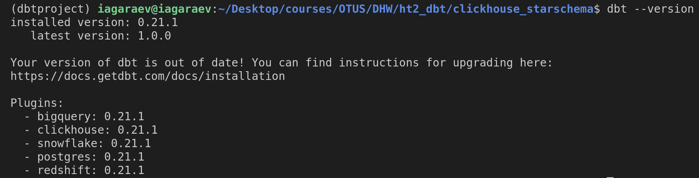
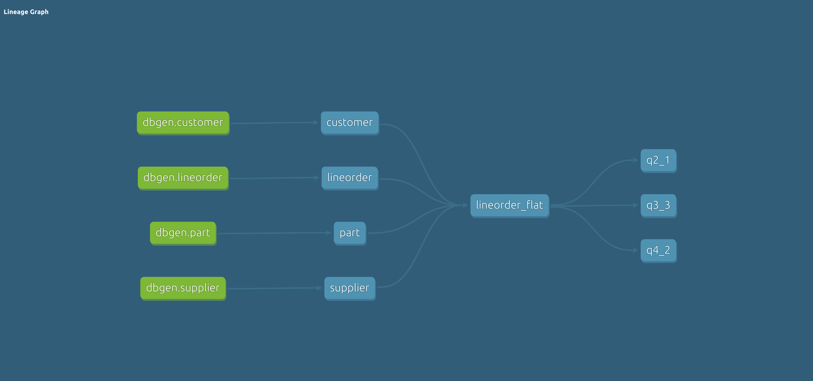
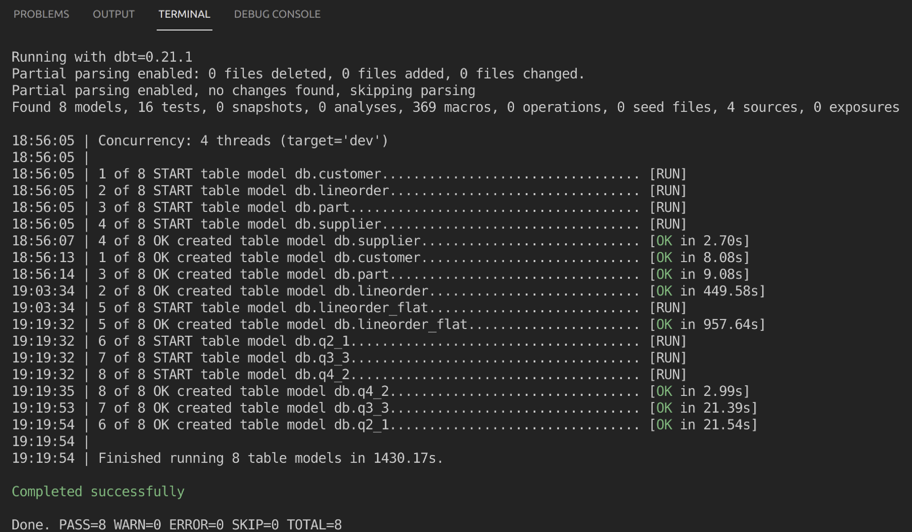
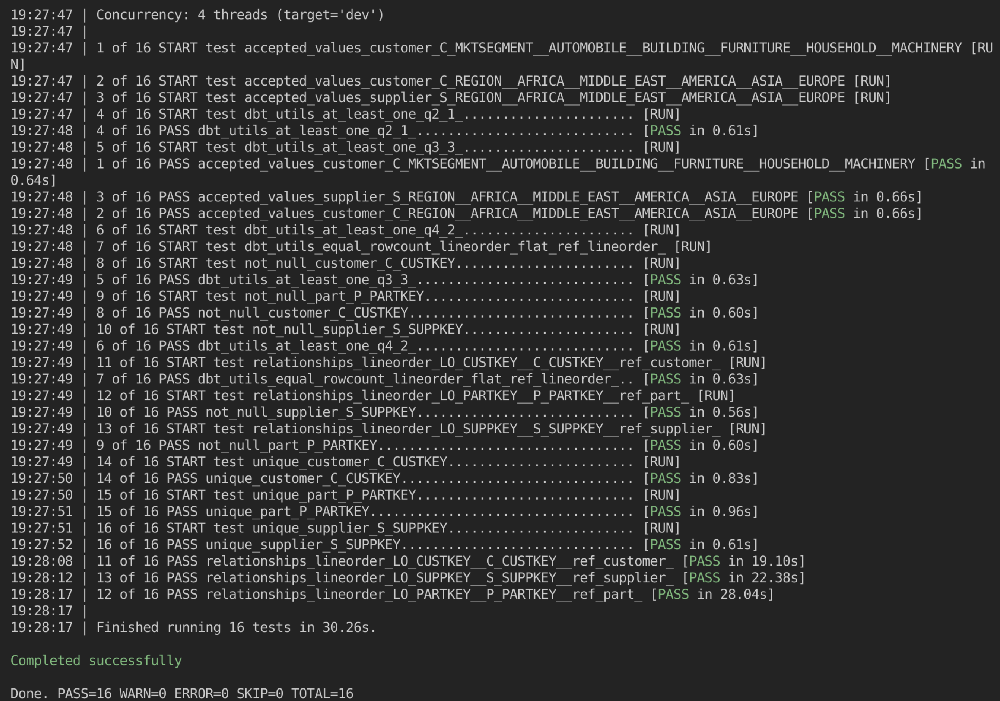
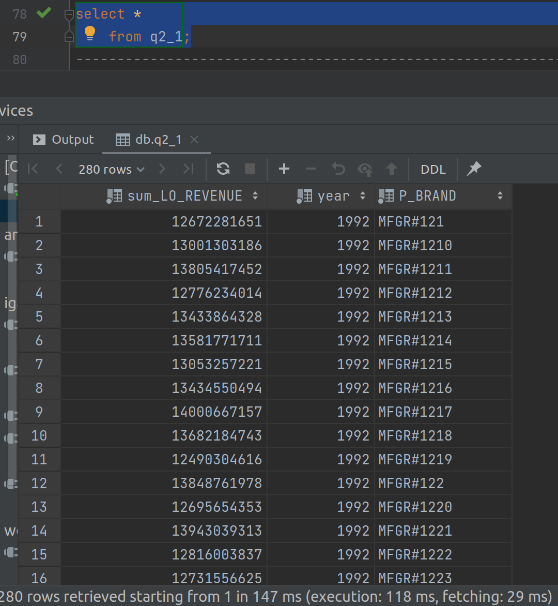
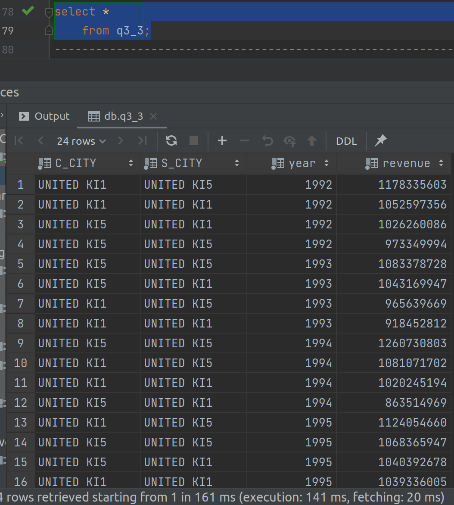
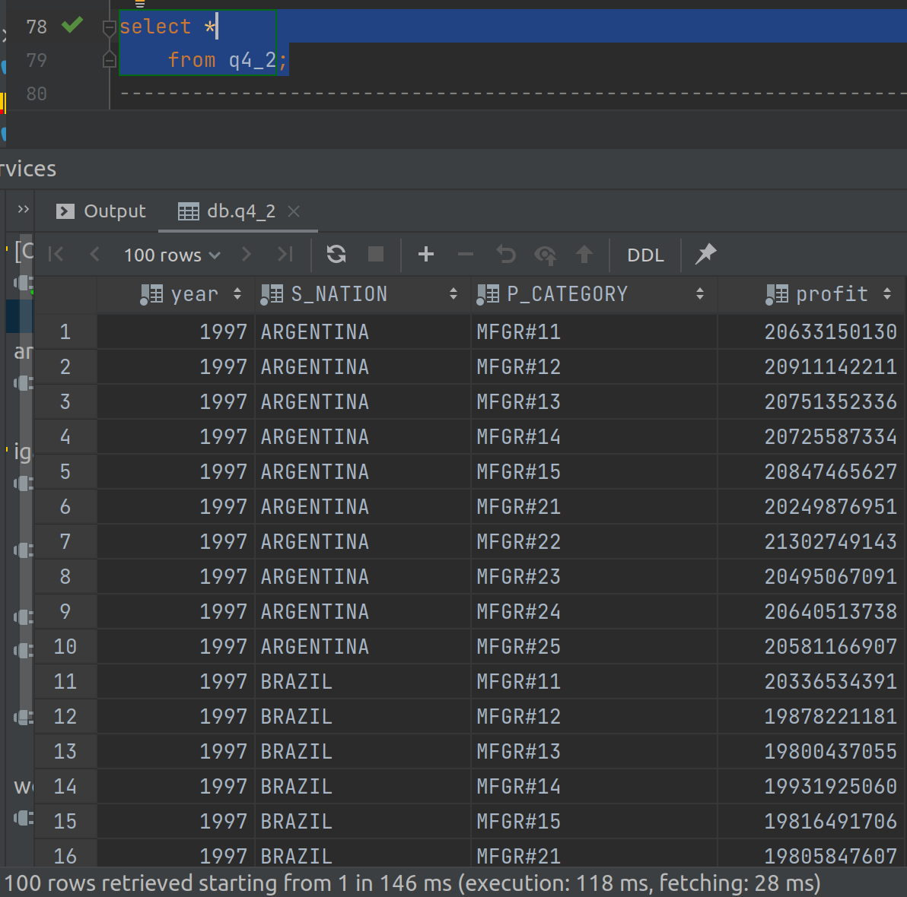

### Домашняя работа №2 по курсу OTUS Data Warehouse Analyst
Целью домашнего задания является развертывание кластера ClickHouse в Яндекс.Облаке, 
создание учебного проекта dbt для загрузки данных из S3 и построения витрин.
Описание задания: https://gist.github.com/kzzzr/8d50126079df1a8e5646342f6247df22

### Создание кластера
Осуществляется запросом:
```
yc managed-clickhouse cluster create \
    --name clickhouse-dwh \
    --network-name default \
    --host type=clickhouse,zone-id=ru-central1-b,subnet-name=default-ru-central1-b,assign-public-ip \
    --user name=<name>,password=<password> \
    --database name=db \
    --clickhouse-resource-preset s2.micro \
    --clickhouse-disk-type network-ssd \
    --clickhouse-disk-size 70
```

### Версия Dbt  



### Модель данных


### Запуск проекта 

по отдельности
```
    dbt run -m tag:staging
    dbt run -m tag:star
    dbt run -m tag:marts
```

либо  полностью проект 

```
    dbt run --full-refresh
```



### Тестирование проекта 

```
    dbt test -m tag:staging
    dbt test -m tag:star
    dbt test -m tag:marts

    dbt test
```



### Создание документа проекта

```
    dbt docs generate
    dbt docs serve
```
### Результаты запросов 

##q2_1 

```
    SELECT
        sum(LO_REVENUE),
        toYear(LO_ORDERDATE) AS year,
        P_BRAND
    FROM lineorder_flat
    WHERE P_CATEGORY = 'MFGR#12' AND S_REGION = 'AMERICA'
    GROUP BY
        year,
        P_BRAND
    ORDER BY
        year,
        P_BRAND;
```



##q3_3

```
    SELECT
        C_CITY,
        S_CITY,
        toYear(LO_ORDERDATE) AS year,
        sum(LO_REVENUE) AS revenue
    FROM lineorder_flat
    WHERE (C_CITY = 'UNITED KI1' OR C_CITY = 'UNITED KI5') AND (S_CITY = 'UNITED KI1' OR S_CITY = 'UNITED KI5') AND year >= 1992 AND year <= 1997
    GROUP BY
        C_CITY,
        S_CITY,
        year
    ORDER BY
        year ASC,
        revenue DESC;
```



##q4_2

```
    SELECT
        toYear(LO_ORDERDATE) AS year,
        S_NATION,
        P_CATEGORY,
        sum(LO_REVENUE - LO_SUPPLYCOST) AS profit
    FROM lineorder_flat
    WHERE C_REGION = 'AMERICA' AND S_REGION = 'AMERICA' AND (year = 1997 OR year = 1998) AND (P_MFGR = 'MFGR#1' OR P_MFGR = 'MFGR#2')
    GROUP BY
        year,
        S_NATION,
        P_CATEGORY
    ORDER BY
        year ASC,
        S_NATION ASC,
        P_CATEGORY ASC;
```


